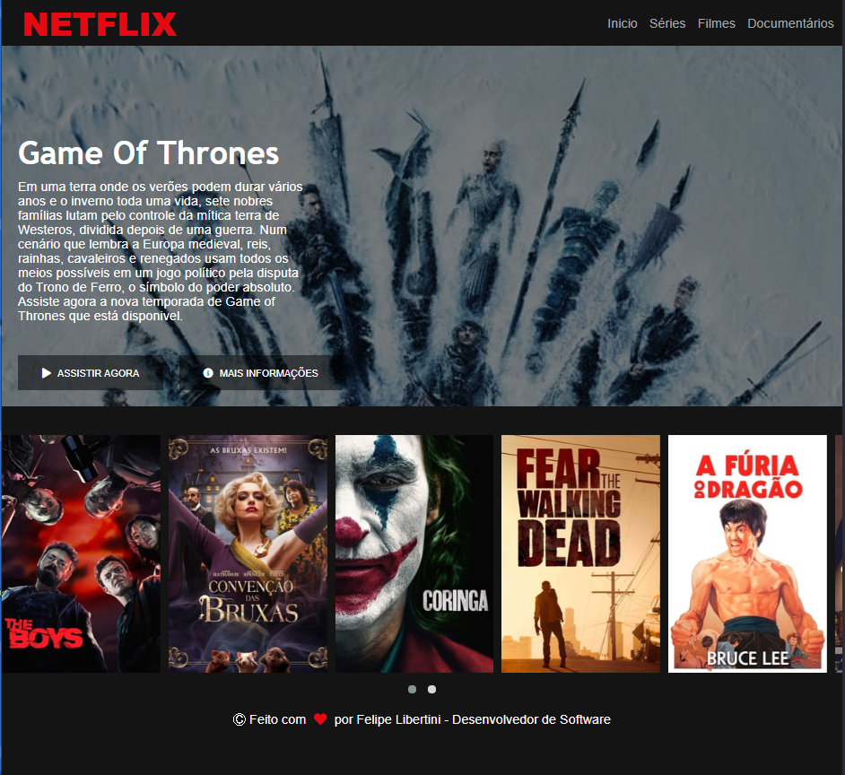

<h1 align="center">Clone da Netflix</h1>

Clonando interface da Netflix para treinamento em HTML e CSS. Proposto pelo curso de Desenvolvimento de jogos em Javascript da Digital Innovation One

<h4 align="center"> 
	🚧  React Select 🚀 Finalizado...  🚧
</h4>

<h1 align="center">
  
</h1>

### 🛠 Tecnologias

As seguintes ferramentas foram usadas na construção do projeto:

- [HTML](https://developer.mozilla.org/pt-BR/docs/Web/HTML/HTML5)
- [CSS](https://www.w3schools.com/css/)
- [jQuery](https://jquery.com/)
- [Owl Carousel 2](https://owlcarousel2.github.io/OwlCarousel2/)
- [Font Awesome](https://fontawesome.com/)

### Autor
---

<a href="http://raziisz.github.io/">
 
  
 <b>Luiz Felipe</b></a> <a href="http://raziisz.github.io/" title="Dev">🚀</a>

Feito com ❤️ por Luiz Felipe 👋🏽 Entre em contato!

 

